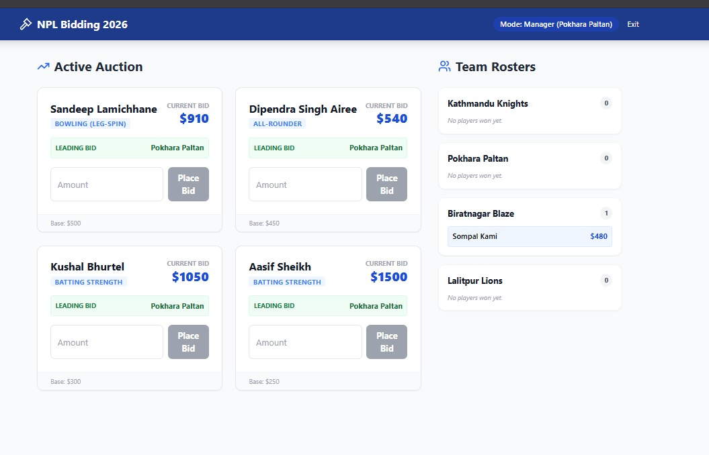
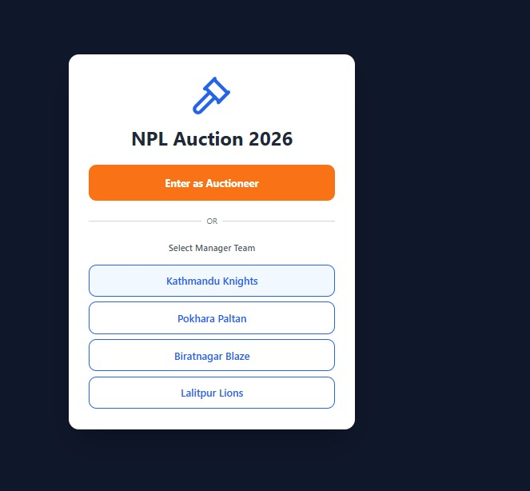

# NPL Bidding Application (NPL Auction Platform)

A web-based **Nepal Premier League (NPL)** player auction/bidding platform where an **auctioneer controls the auction**, team managers **bid in real-time**, and players are **dynamically assigned** to teams based on winning bids.

This repository contains:
- **Backend:** Python + Flask (+ Socket.IO for real-time events)
- **Frontend:** React (TypeScript)
- **Database:** SQLite (lightweight, file-based)

---

## Screenshots






---

## Key Features

- **Live auction room** with real-time bid updates (Socket.IO)
- **Auctioneer controls** (start/stop bidding, move to next player, finalize sale)
- **Player profiles** and auction pool management
- **Dynamic team assignment** when a bid wins
- **Responsive UI** for mobile/tablet/desktop
- **REST API** for core data operations

---

## Tech Stack

### Frontend
- React + **TypeScript**
- Create React App tooling

### Backend
- **Python** + Flask
- Socket.IO (real-time bid broadcasting)

### Database
- **SQLite** (`.db` file stored in the backend)

---

## Repository Structure (high level)

```text
NPL-bidding/
  backend/               # Flask API + Socket.IO server
  frontend/              # React (TypeScript) client
  deployed/              # Screenshots/assets used in README
  README.md
```

(Exact files may vary—see the folders for implementation details.)

---

## Prerequisites

Install these before running locally:

- **Node.js** 16+ (18+ recommended)
- **npm** (comes with Node)
- **Python** 3.9+
- (Optional but recommended) **Git**

---

## End-to-End Setup (Run Locally)

> You’ll run the backend and frontend in **two separate terminals**.

### 1) Clone the repository

```bash
git clone https://github.com/AnanyaGubba/NPL-bidding.git
cd NPL-bidding
```

---

### 2) Backend (Flask)

```bash
cd backend

# create virtual environment
python -m venv venv

# activate venv
# Windows (PowerShell)
.\venv\Scripts\Activate.ps1
# Windows (CMD)
# venv\Scripts\activate
# macOS/Linux
# source venv/bin/activate

# install dependencies
pip install -r requirements.txt

# run the backend
python app.py
```

Backend should start on something like:
- `http://localhost:5000`

> If your backend uses a different port, update the frontend API base URL accordingly.

---

### 3) Frontend (React)

Open a new terminal:

```bash
cd frontend
npm install
npm start
```

Frontend should start at:
- `http://localhost:3000`

---

## Configuration Notes

Depending on how the project is wired, you may need one of these adjustments:

### API base URL / Proxy
- If the frontend is using CRA proxy, ensure `frontend/package.json` has:
  - `"proxy": "http://localhost:5000"`
- Otherwise, set the backend URL via an environment variable (example):
  - `REACT_APP_API_URL=http://localhost:5000`

### Socket.IO URL
- If Socket.IO isn’t connecting, verify the frontend points to the correct backend host/port.
- Also ensure CORS settings in Flask allow `http://localhost:3000`.

---

## How to Use (Typical Auction Flow)

1. Start backend + frontend.
2. Open the app in the browser.
3. Auctioneer selects/starts the auction for a player.
4. Team managers place bids.
5. Highest bid wins when auctioneer finalizes the round.
6. Player is assigned to the winning team and removed from the available pool.

---

## Database

- Uses **SQLite** for local persistence.
- The database file is typically stored within `backend/` (example: `npl_bidding.db`).

If you reset the auction data frequently during development, you can:
- delete the `.db` file (if safe for your workflow), then re-run the backend
- or use any built-in seed/init route if the project includes one

---

## Deployment

You can deploy the frontend and backend separately.

### Frontend
- Deploy `frontend/` to **Vercel** or **Netlify**
- Configure environment variables for API + Socket.IO URL (production backend URL)

### Backend
- Deploy `backend/` to **Render**, **Heroku**, or similar
- Ensure the platform supports:
  - WebSockets / long-lived connections (for Socket.IO)
  - A persistent disk/volume if you want to keep the SQLite `.db` file

---

## Testing

Frontend:
```bash
cd frontend
npm test
```

Backend (if tests exist):
```bash
cd backend
# example
pytest
```

---

## Troubleshooting

### `ModuleNotFoundError` or dependency issues (backend)
- Ensure virtual environment is activated
- Re-run:
  ```bash
  pip install -r requirements.txt
  ```

### Frontend can’t reach backend
- Confirm backend is running
- Check the API base URL or CRA proxy setup
- Verify CORS settings on the backend

### Socket.IO not updating bids live
- Confirm both servers are running
- Confirm the Socket.IO URL matches the backend
- Check browser console + backend logs for connection errors

---

## License

Add a license if you intend to open-source this project (MIT is common).

---

## Acknowledgements

Built to support an interactive auction process for sports league team management.
